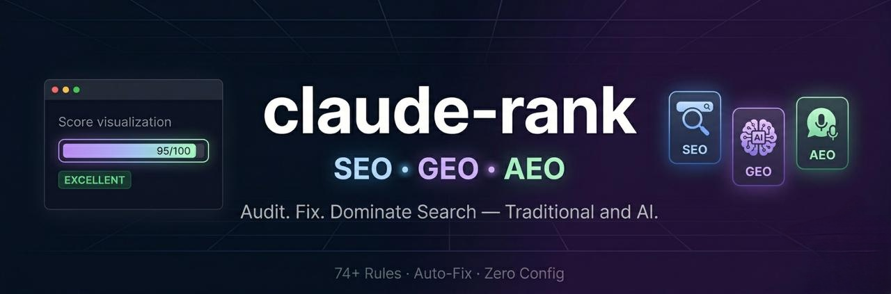

<div align="center">



### The most comprehensive SEO/GEO/AEO plugin for Claude Code. 170+ rules. 10 scanners. Competitive X-Ray. Auto-fix everything. Dominate search — traditional and AI.

[](https://github.com/Houseofmvps/claude-rank/actions/workflows/ci.yml)
[](https://www.npmjs.com/package/@houseofmvps/claude-rank)
[](https://www.npmjs.com/package/@houseofmvps/claude-rank)
[](https://www.npmjs.com/package/@houseofmvps/claude-rank)
[](https://github.com/Houseofmvps/claude-rank/stargazers)
[](LICENSE)
[](https://github.com/sponsors/Houseofmvps)

---

[](https://x.com/kaileskkhumar)
[](https://www.linkedin.com/in/kailesk-khumar)
[](https://houseofmvps.com)

**Built by [Kailesk Khumar](https://www.linkedin.com/in/kailesk-khumar), solo founder of [houseofmvps.com](https://houseofmvps.com)**

*One indie hacker. One plugin. Every search engine covered.*

</div>

---

## See It In Action

```
$ claude-rank scan ./my-saas-landing

claude-rank / SEO Audit
──────────────────────────────────────────────────

  55   ━━━━━━━━━━━─────────  Poor

  Files scanned: 26    Findings: 276    Critical: 0  High: 236  Medium: 40  Low: 0

──────────────────────────────────────────────────
  ✘ Must Fix (2 issues)

  HIGH   thin-content
         Page has only 294 words in main content (minimum recommended: 300)
         → Expand main content to 300+ words

  HIGH   broken-internal-link (26 pages)
         Broken internal link "/#how-it-works" — target file not found
         → Fix or remove the broken link — check the href path
```

```
$ claude-rank geo ./my-saas-landing

claude-rank / GEO Audit
──────────────────────────────────────────────────

  80   ━━━━━━━━━━━━━━━━────  Good

  Files scanned: 26    Findings: 4    Medium: 4
```

```
$ claude-rank citability ./my-saas-landing

claude-rank / AI Citability Score
──────────────────────────────────────────────────

  67   ━━━━━━━━━━━━━───────  Below Average

  7-Dimension Breakdown
  Statistic Density        ━━──────────────────  12/100
  Front-Loading            ━━━─────────────────  15/100
  Source Citations          ────────────────────  0/100
  Expert Attribution       ━━──────────────────  8/100
  Definition Clarity       ━───────────────────  4/100
  Schema Completeness      ━━━─────────────────  14/100
  Content Structure        ━━━─────────────────  13/100
```

```
$ claude-rank compete https://competitor.com ./my-project

claude-rank / Competitive X-Ray
──────────────────────────────────────────────────

  You:  12 wins    Them:  6 wins    Ties:  2

  Area                      You           Them          Winner
  ────────────────────────────────────────────────────────────
  Word count                1,247         386           ✓ You
  JSON-LD schemas           3             0             ✓ You
  Conversion signals        5             2             ✓ You
  Internal links            12            3             ✓ You

  Tech Stack:
    You:  Next.js, Tailwind CSS, Stripe
    Them: WordPress, Google Analytics
```

*Real output from scanning [savemrr.co](https://savemrr.co) (26-page SaaS landing) and [houseofmvps.com](https://houseofmvps.com).*

---

## Quick Start

### Use as a Claude Code Plugin (recommended)

claude-rank works as a full Claude Code plugin with skills, agents, and slash commands.

**Option A — Install from GitHub (recommended):**
```
/plugin marketplace add Houseofmvps/claude-rank
/plugin install claude-rank@Houseofmvps-claude-rank
```

**Option B — Install from a local clone:**
```bash
git clone https://github.com/Houseofmvps/claude-rank.git
```
Then in Claude Code:
```
/plugin marketplace add ./claude-rank
/plugin install claude-rank@claude-rank
```

After installing, run `/reload-plugins` to activate in your current session.

Once installed, use slash commands:

```
/claude-rank:rank              # Smart routing — detects what your project needs
/claude-rank:rank-audit        # Full 10-scanner audit with auto-fix + GSC action plan
/claude-rank:rank-geo          # Deep AI search optimization audit
/claude-rank:rank-aeo          # Answer engine optimization audit
/claude-rank:rank-fix          # Auto-fix all findings in one command
/claude-rank:rank-schema       # Detect, validate, generate, inject JSON-LD
/claude-rank:rank-compete      # Competitive X-Ray — compare vs any competitor URL
/claude-rank:rank-citability   # AI Citability Score — 7-dimension analysis
/claude-rank:rank-content      # Content intelligence analysis
/claude-rank:rank-perf         # Performance risk assessment
/claude-rank:rank-vertical     # E-Commerce / Local Business SEO
/claude-rank:rank-security     # Security headers audit
```

**Zero configuration.** claude-rank reads your project structure and self-configures.

### Use standalone — no install needed

```bash
npx @houseofmvps/claude-rank scan ./my-project          # Local directory
npx @houseofmvps/claude-rank scan https://example.com    # Live URL (crawls up to 50 pages)
npx @houseofmvps/claude-rank geo ./my-project            # AI search audit
npx @houseofmvps/claude-rank aeo ./my-project            # Answer engine audit
npx @houseofmvps/claude-rank citability ./my-project     # AI citability score
npx @houseofmvps/claude-rank content ./my-project        # Content intelligence
npx @houseofmvps/claude-rank keyword ./my-project        # Keyword clustering
npx @houseofmvps/claude-rank brief ./my-project "seo"    # Content brief
npx @houseofmvps/claude-rank perf ./my-project           # Performance audit
npx @houseofmvps/claude-rank vertical ./my-project       # E-commerce / local SEO
npx @houseofmvps/claude-rank security ./my-project       # Security audit
npx @houseofmvps/claude-rank compete https://comp.com .  # Competitive X-Ray
npx @houseofmvps/claude-rank schema ./my-project         # Structured data
npx @houseofmvps/claude-rank scan . --report html        # Agency-ready HTML report
npx @houseofmvps/claude-rank scan . --threshold 80       # CI/CD mode
npx @houseofmvps/claude-rank scan . --json               # Raw JSON output
```

### Install globally

```bash
npm install -g @houseofmvps/claude-rank    # scoped (official)
npm install -g claude-rank-seo             # unscoped (shorter)
claude-rank scan ./my-project
```

> Both packages are identical. `claude-rank-seo` is an unscoped alias for easier `npx` usage.

---

## The Problem

You shipped your SaaS. Traffic is flat. You Google your product name — page 3. You ask ChatGPT about your niche — your site isn't mentioned. Perplexity doesn't cite you. Google AI Overviews skips you entirely.

Most SEO tools check title tags and call it a day. They don't know that:

- **AI search engines are replacing traditional search** — and your content isn't optimized for them
- **Featured snippets and voice search** have completely different optimization rules than regular SEO
- **Your robots.txt is blocking GPTBot, PerplexityBot, and ClaudeBot** — AI can't cite what it can't crawl
- **You don't have an llms.txt** — the file AI assistants look for to understand your project
- **Your structured data is missing or broken** — you're invisible to rich results

That's not an SEO problem. That's a visibility problem across every search surface that exists in 2026.

## The Solution

```
/claude-rank:rank-audit
```

One command. Ten scanners run in parallel — SEO, GEO, AEO, AI Citability, Content Intelligence, Keyword Clustering, Performance, Vertical SEO, Security, and Content Brief. 170+ rules checked. Every finding gets an automated fix. Score tracked over time. **Then it tells you exactly what to do in Google Search Console and Bing Webmaster Tools.**

```
SEO Score:         87/100  ████████████░░  (50 rules)
GEO Score:         92/100  █████████████░  (45 rules + E-E-A-T)
AEO Score:         78/100  ██████████░░░░  (12 rules)
Citability Score:  65/100  ████████░░░░░░  (7 dimensions)
Performance:       90/100  █████████████░  (16 rules)
Security:          80/100  ███████████░░░  (15 rules)
Overall:           86/100  READY TO RANK
```

**Score below 80?** Run `/claude-rank:rank-fix` and it auto-generates what's missing — robots.txt, sitemap.xml, llms.txt, JSON-LD schema — then re-scans to show your improvement.

---

## All 10 Scanners

### 1. SEO Scanner — 50 Rules

Traditional search optimization. The foundation.

| Category | What it checks |
|---|---|
| **Meta** | Title (length, uniqueness), meta description, viewport, charset, canonical URL, lang attribute |
| **Content** | H1 presence, heading hierarchy, word count (`<main>` only), image alt text, thin content, readability (Flesch-Kincaid), passive voice |
| **Technical** | robots.txt, sitemap.xml, HTTPS, mobile-friendly viewport, analytics (30+ providers), redirect chains, lazy loading, hreflang |
| **Structured Data** | JSON-LD presence, validation against Google's required fields (14 schema types), dateModified freshness |
| **Cross-Page** | Duplicate titles, duplicate descriptions, duplicate content (Jaccard >80%), canonical conflicts, orphan pages, broken internal links |

### 2. GEO Scanner — 45 Rules + E-E-A-T

Generative Engine Optimization. For AI search: ChatGPT, Perplexity, Gemini, Google AI Overviews.

| Category | What it checks |
|---|---|
| **AI Crawlers** | robots.txt for 11 bots: GPTBot, PerplexityBot, ClaudeBot, Claude-Web, Google-Extended, CCBot, AppleBot, Bytespider, Meta-ExternalAgent, Amazonbot, anthropic-ai |
| **AI Discoverability** | llms.txt, sitemap.xml, structured data quality |
| **Content Structure** | Question-format H2s (filters marketing headers), definition patterns, statistics, data tables, lists |
| **Citation Readiness** | 134-167 word passage sweet spot, direct answers in first 40-60 words, citations to .edu/.gov/.org |
| **E-E-A-T** | Author bio, credentials/expertise, about/team page, reviews/testimonials, external authority links |

### 3. AEO Scanner — 12 Rules

Answer Engine Optimization. Featured snippets, People Also Ask, voice search.

| Category | What it checks |
|---|---|
| **Schema** | FAQPage, HowTo, speakable, Article structured data |
| **Snippet Fitness** | Answer paragraph length (40-60 words optimal), numbered steps, definition patterns |
| **Voice Search** | Concise answers under 29 words, conversational phrasing |

### 4. AI Citability Score — 7 Dimensions

Proprietary scoring algorithm. Scores how likely AI engines are to cite each page (0-100).

| Dimension | Weight | What it measures |
|---|---|---|
| **Statistic Density** | 0-15 | Data points per 200 words |
| **Front-loading** | 0-15 | Key answer in first 30% of content |
| **Source Citations** | 0-15 | Links to .edu/.gov/research domains |
| **Expert Attribution** | 0-15 | Person schema, author bios, expert quotes |
| **Definition Clarity** | 0-10 | "X is..." / "X refers to..." extraction patterns |
| **Schema Completeness** | 0-15 | Organization + Author + Article + FAQ + Breadcrumb |
| **Content Structure** | 0-15 | Heading hierarchy, lists, paragraph segmentation |

### 5. Content Intelligence

Deep content quality analysis across all pages.

| Category | What it analyzes |
|---|---|
| **Readability** | Flesch-Kincaid score, Gunning Fog index, per-page scoring |
| **Duplicate Detection** | Jaccard similarity fingerprinting across all page pairs |
| **Thin Content** | Pages under 300 words flagged |
| **Internal Linking** | Suggests cross-links for pages sharing H2 topics |
| **Orphan Pages** | Pages with zero incoming internal links |
| **Hub Pages** | Identifies pillar pages with 5+ outgoing internal links |
| **Topic Clusters** | Groups pages by shared keywords |

### 6. Keyword Clustering (TF-IDF)

| Category | What it analyzes |
|---|---|
| **Primary Keyword** | Highest-weighted keyword per page (from H1/title) |
| **TF-IDF Scoring** | Term frequency / inverse document frequency across your content |
| **Topic Clusters** | Pages grouped by 3+ shared significant keywords |
| **Keyword Cannibalization** | Multiple pages targeting the same primary keyword |
| **Content Gaps** | Keywords only covered by 1 page — opportunity for more content |
| **Pillar Suggestions** | When 3+ pages share a theme, suggests creating a pillar page |

### 7. Content Brief Generator

Generate SEO-optimized writing briefs from your existing content.

| Category | What it generates |
|---|---|
| **Suggested Title** | H1 based on target keyword and existing content patterns |
| **Word Count Target** | Avg of related pages + 20% to outperform |
| **H2 Outline** | From analyzing related content structure |
| **Questions to Answer** | Extracted from FAQ patterns and question headings |
| **Internal Links** | Pages to link to/from for topical authority |
| **Related Keywords** | Extracted from related pages via TF-IDF |
| **GEO Tips** | Statistics to include, expert quotes, citation opportunities |

### 8. Performance Scanner — 16 Rules

Performance risk detection from static HTML — no Chrome or Lighthouse needed.

| Category | What it checks |
|---|---|
| **CLS Risk** | Images without width/height dimensions |
| **Render Blocking** | Scripts without async/defer, excessive blocking scripts |
| **Payload** | Large inline CSS/JS (>50KB), too many external domains |
| **Loading** | Missing lazy loading, missing fetchpriority for LCP image |
| **Fonts** | Web fonts without font-display: swap |
| **Images** | Responsive images (srcset/sizes), modern formats (WebP/AVIF) |

### 9. Vertical SEO — 20 Rules

Auto-detects e-commerce and local business sites, then runs specialized checks. SaaS sites with pricing pages are correctly excluded via strong/weak signal weighting.

| Type | Rules | What it checks |
|---|---|---|
| **E-Commerce** | 10 | Product schema, Offer schema, AggregateRating, reviews, product images, descriptions, breadcrumbs, pricing, availability, duplicate descriptions |
| **Local Business** | 10 | LocalBusiness schema, NAP data, geo coordinates, opening hours, Google Maps, clickable phone, local keywords, address element, service area pages |

### 10. Security & Headers — 15 Rules

Security compliance that directly affects SEO (Google confirmed HTTPS as a ranking signal).

| Category | What it checks |
|---|---|
| **HTTPS** | Mixed content, upgrade-insecure-requests |
| **Headers** | CSP, X-Content-Type-Options, X-Frame-Options, Referrer-Policy, Permissions-Policy |
| **Integrity** | Subresource Integrity (SRI) on external scripts |
| **Safety** | Inline event handlers, form actions over HTTP, target="_blank" noopener, iframe sandbox |

---

## More Features

### Competitive X-Ray

Point at any competitor URL. claude-rank fetches their page and compares everything side-by-side:

- **Tech Stack** — 50+ detection patterns (Wappalyzer-style): framework, CMS, CDN, analytics, payments, chat
- **SEO Signals** — title, meta, canonical, Open Graph, Twitter Card, structured data
- **Content Depth** — word count, heading structure, links
- **Conversion Signals** — CTAs, pricing, demo booking, social proof, waitlists (24 patterns)
- **Quick Wins** — gaps to close and strengths to keep

```bash
claude-rank compete https://competitor.com ./my-project
```

No API keys. No rate limits. No signup. Just point and compare.

### Core Web Vitals (Lighthouse)

```bash
claude-rank cwv https://example.com
```

| Metric | Good | Poor |
|---|---|---|
| **LCP** (Largest Contentful Paint) | < 2.5s | > 4.0s |
| **CLS** (Cumulative Layout Shift) | < 0.1 | > 0.25 |
| **FCP** (First Contentful Paint) | < 1.8s | > 3.0s |
| **TBT** (Total Blocking Time) | < 200ms | > 600ms |

No separate install — uses `npx -y lighthouse@12` automatically. Just needs Chrome.

### Auto-Fix Generators

Every finding has a fix. Not "consider adding" — actual file generation:

| Generator | What it creates |
|---|---|
| **robots.txt** | AI-friendly rules allowing all 11 AI crawlers + sitemap directive |
| **sitemap.xml** | Auto-detected routes (Next.js App/Pages Router, static HTML) |
| **llms.txt** | AI discoverability file from your package.json |
| **JSON-LD** | 12 types: Organization, Article, Product, FAQPage, HowTo, LocalBusiness, Person, WebSite, BreadcrumbList, SoftwareApplication, VideoObject, ItemList |

### Schema Engine — Full CRUD

```
Detect  → Find all JSON-LD in your HTML files
Validate → Check against Google's required fields (14 schema types)
Generate → Create missing schema from your project data
Inject   → Add generated schema into your HTML <head>
```

### Post-Audit Action Plans

**This is what separates claude-rank from every other SEO scanner.** After fixing issues, it tells you exactly what to do next:

**Google Search Console:** Submit sitemap, request indexing for money pages, check coverage, validate rich results, monitor CWV.

**Bing Webmaster Tools:** Submit URLs (10,000/day), enable IndexNow for near-instant re-indexing, verify robots.txt (Bingbot powers Microsoft Copilot and ChatGPT Browse).

**AI Search Verification:** Test your brand in ChatGPT, Perplexity, Gemini. Verify llms.txt. Weekly monitoring checklist.

### Multi-Page URL Crawling

```bash
claude-rank scan https://example.com              # Crawls up to 50 pages
claude-rank scan https://example.com --pages 10    # Limit to 10 pages
claude-rank scan https://example.com --single      # Just one page
```

BFS crawl, 3 concurrent fetches, cross-page duplicate/canonical analysis.

### HTML Report Export

```bash
claude-rank scan ./my-project --report html
```

Self-contained `claude-rank-report.html` — dark theme, score rings, detailed findings. No external dependencies. Ready to send to clients.

### CI/CD Mode

```bash
claude-rank scan ./my-project --threshold 80
# Exit code 1 if score < 80 — add to your CI pipeline
```

### Score Tracking

Every audit saves scores. See trends over time:

```
2026-03-25  SEO: 62  GEO: 45  AEO: 38
2026-03-26  SEO: 78  GEO: 72  AEO: 65  (+16, +27, +27)
2026-03-28  SEO: 87  GEO: 92  AEO: 78  (+9, +20, +13)
```

---

## Scoring System

All scores: 0-100. Higher is better.

| Severity | Deduction | Example |
|----------|-----------|---------|
| Critical | -20 | No title tag, robots.txt blocking all crawlers |
| High | -10 | Missing meta description, no JSON-LD, AI bots blocked |
| Medium | -5 | Title too long, missing OG tags, no llms.txt |
| Low | -2 | Missing lang attribute, no analytics detected |

Same rule on multiple pages = one deduction (not N). Consistent across all 10 scanners.

---

## CLI Commands

| Command | Description |
|---------|-------------|
| `scan ./project` | SEO scan — 50 rules |
| `scan https://example.com` | Crawl + scan live site (up to 50 pages) |
| `geo ./project` | GEO — AI search optimization (45 rules + E-E-A-T) |
| `aeo ./project` | AEO — answer engine optimization (12 rules) |
| `citability ./project` | AI Citability Score — 7 dimensions |
| `content ./project` | Content intelligence — readability, duplicates, linking |
| `keyword ./project` | Keyword clustering — TF-IDF, cannibalization, gaps |
| `brief ./project "keyword"` | Content brief generator |
| `perf ./project` | Performance risk assessment (16 rules) |
| `vertical ./project` | Vertical SEO — e-commerce + local (20 rules) |
| `security ./project` | Security headers audit (15 rules) |
| `compete https://comp.com .` | Competitive X-Ray |
| `cwv https://example.com` | Core Web Vitals via Lighthouse |
| `schema ./project` | Detect + validate structured data |
| `help` | Show available commands |

**Flags:** `--json` (raw output) | `--report html` (visual report) | `--threshold N` (CI mode) | `--pages N` (crawl limit) | `--single` (one page only)

---

## Comparison: claude-rank vs claude-seo

| Feature | claude-rank | claude-seo |
|---------|:-----------:|:----------:|
| SEO rules | 50 | ~20 |
| GEO — AI search (Perplexity, ChatGPT, Gemini) | 45 rules + E-E-A-T | Basic |
| AEO — featured snippets, voice search | 12 rules | None |
| AI Citability Score (7-dimension) | Yes | No |
| Content Intelligence (readability, duplicates) | Yes | No |
| Keyword Clustering (TF-IDF) | Yes | No |
| Content Brief Generator | Yes | No |
| Performance Risk Assessment | Yes | No |
| Vertical SEO (e-commerce + local) | Auto-detection | No |
| Security Headers Audit | Yes | No |
| Competitive X-Ray (50+ tech patterns) | Side-by-side | No |
| Core Web Vitals / Lighthouse | Yes | No |
| Schema engine (detect/validate/generate/inject) | Full CRUD | Detect only |
| Auto-fix generators (robots.txt, sitemap, llms.txt, JSON-LD) | Yes | No |
| Post-audit GSC/Bing action plans | Yes | No |
| Cross-page analysis (duplicates, orphans, canonicals) | Yes | No |
| Multi-page URL crawling | Up to 50 pages | No |
| HTML report export | Agency-ready | No |
| CI/CD threshold mode | Yes | No |
| Score tracking with trends | Yes | No |
| Broken internal link detection | Filesystem resolution | No |
| Image optimization audit (srcset, WebP/AVIF) | Yes | No |
| AI bot detection | 11 bots | Basic |

**claude-seo tells you what's wrong. claude-rank fixes it.**

---

## Terminology

- **GEO (Generative Engine Optimization)** — optimization for AI-powered search engines that generate answers (Perplexity, ChatGPT Search, Gemini, Google AI Overviews). NOT geographic.
- **AEO (Answer Engine Optimization)** — optimization for direct answer features: featured snippets, People Also Ask, voice assistants.
- **SEO (Search Engine Optimization)** — traditional Google/Bing crawlability, indexability, on-page signals.

---

## Security

| Protection | How |
|---|---|
| **No shell injection** | `execFileSync` with array args — zero shell interpolation |
| **SSRF protection** | All HTTP tools block private IPs, cloud metadata, non-HTTP schemes |
| **No telemetry** | Zero data collection. No phone-home. Ever. |
| **1 dependency** | `htmlparser2` only (30KB). No native bindings. No `node-gyp`. |
| **372 tests** | All scanners, CLI, integration, security tests |
| **File safety** | 10MB read cap. 5MB response cap. Restrictive write permissions. |

See [SECURITY.md](SECURITY.md) for the full vulnerability disclosure policy.

---

## What's Inside

| Category | Count |
|---|---|
| **Scanners** | 10 (SEO, GEO, AEO, Citability, Content, Keywords, Briefs, Perf, Vertical, Security) |
| **Rules** | 170+ across all scanners |
| **Tools** | 17 (scanners + schema engine + robots/sitemap/llms.txt + competitive X-ray + formatter) |
| **Slash Commands** | 12 |
| **Agents** | 9 autonomous auditors |
| **Skills** | 7 plugin skills |
| **Tests** | 372 |

---

## Requirements

- **Node.js >= 18** (tested on 18, 20, 22 via CI)
- ESM environment (`"type": "module"`)
- No build step required
- Single dependency: `htmlparser2` (30KB)
- Optional for Core Web Vitals: Chrome/Chromium

---

## Sponsor This Project

I built claude-rank alone — nights and weekends, between building my own SaaS products. No VC funding. No team. Just one person who got tired of being invisible to AI search and decided to fix it for everyone.

This plugin is **free forever.** No pro tier. No paywalls. No "upgrade to unlock." Every feature — all 10 scanners, 12 slash commands, 9 agents — is yours, completely free.

If claude-rank helped your site rank higher — one AI citation it earned you, one missing schema it generated, one robots.txt fix that unblocked GPTBot — I'd be grateful if you considered sponsoring.

[](https://github.com/sponsors/Houseofmvps)

*— [Kailesk Khumar](https://www.linkedin.com/in/kailesk-khumar), solo founder of [houseofmvps.com](https://houseofmvps.com)*

---

## Contributing

Found a bug? Want a new scanner rule? [Open an issue](https://github.com/Houseofmvps/claude-rank/issues) or PR.

```bash
git clone https://github.com/Houseofmvps/claude-rank.git
cd claude-rank
npm install
npm test              # 372 tests, node:test
node tools/<tool>.mjs # No build step
```

See [CONTRIBUTING.md](CONTRIBUTING.md) for guidelines.

---

## License

MIT — [LICENSE](LICENSE). **Free forever.** No pro tier. No paywalls.

---

<div align="center">

### If claude-rank helped you rank higher, star the repo — it helps others find it too.

[](https://github.com/Houseofmvps/claude-rank)

**Every star makes this project more visible to developers who need it.**

[Star it now](https://github.com/Houseofmvps/claude-rank) | [Follow @kaileskkhumar](https://x.com/kaileskkhumar) | [Sponsor](https://github.com/sponsors/Houseofmvps)

</div>
